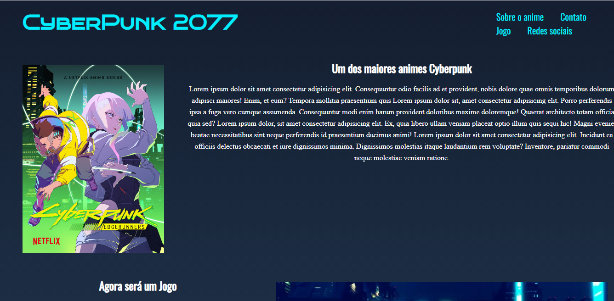
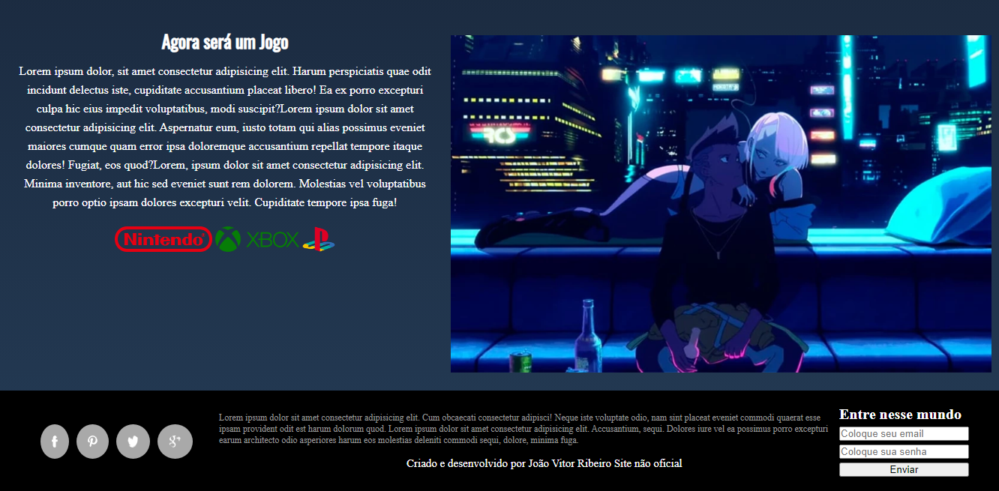

# 🛠 Tecnologias utilizadas:
 

  

  
   
  
  

 

# 💻  Sobre o Projeto:
<li>Esse um projeto desenvolvido durante o módulo de CSS do curso oferecido pela EBAC, com o objetivo de evoluir a construção individual do aluno. O tema escolhido foi "landing page", e a página web foi criada totalmente sozinha, utilizando apenas HTML5 e CSS3. Nele está sendo represantado a landing page de um anime chamado "Cyberpunk 2077" que foi considerado uns dos melhores animes que retrada a temática Cyberpunk, além disso ínclui o formulário para contato. Para disponibilizar a página online, utilizei o serviço do site Velcel.com.</li>
 

# 🎨 Pré-visualização :
## Apresentação da Landing page:

## Apresentação da Landing page:

# 🦸 Autor:

 
<a href="https://www.linkedin.com/in/jo%C3%A3o-vitor-ribeiro-dias-339a56258/" target="_blank">João Vitor RIbeiro Dias</a>
